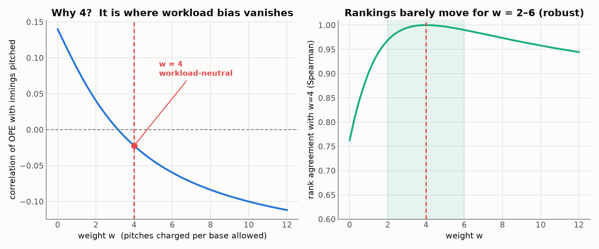
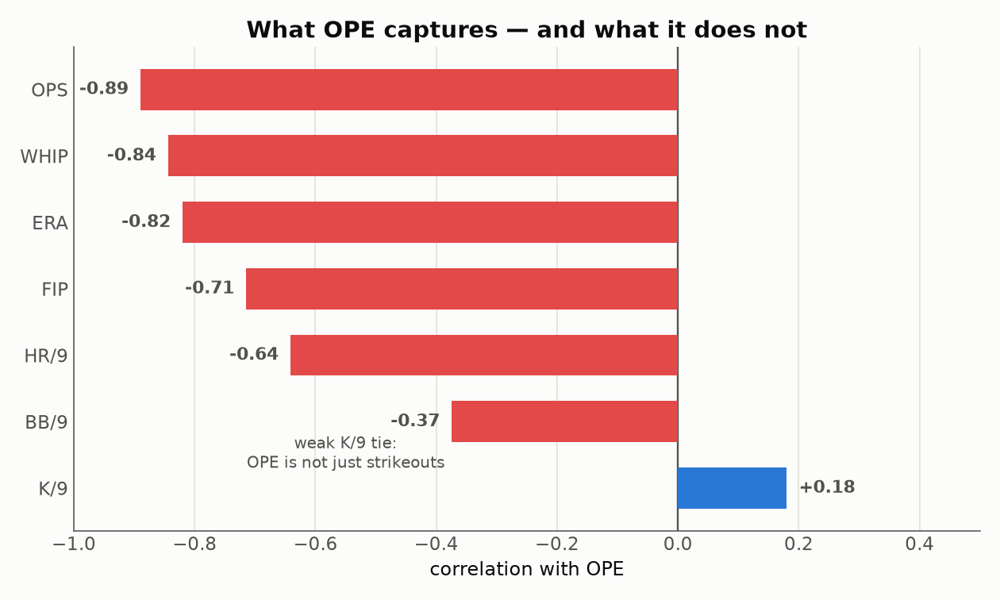
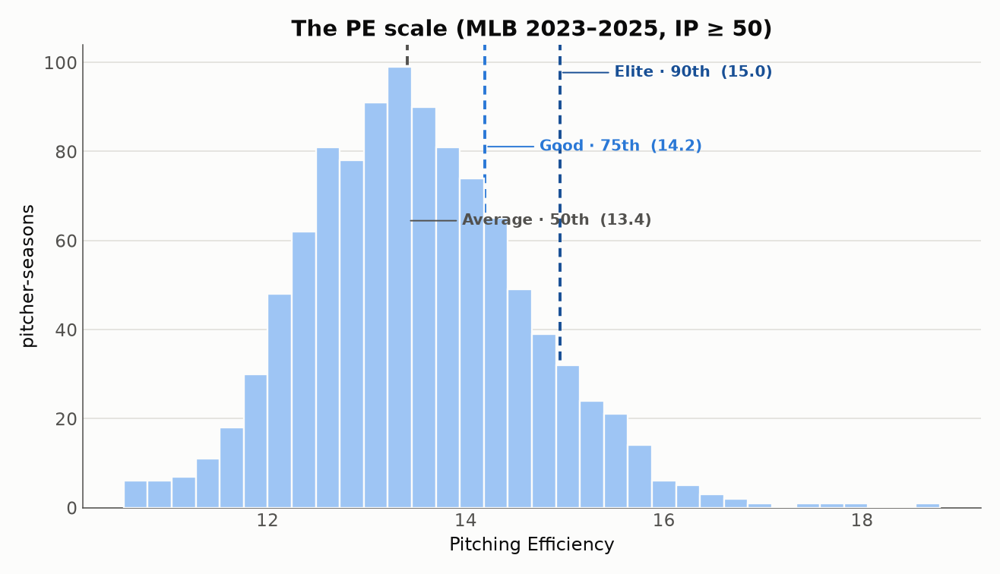
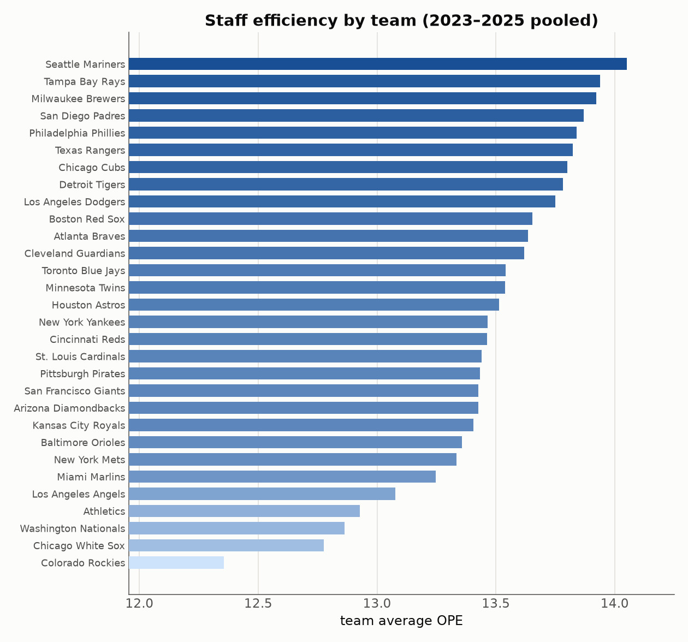
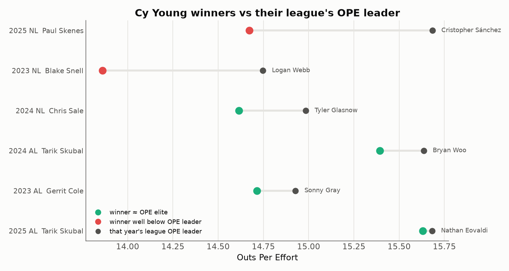
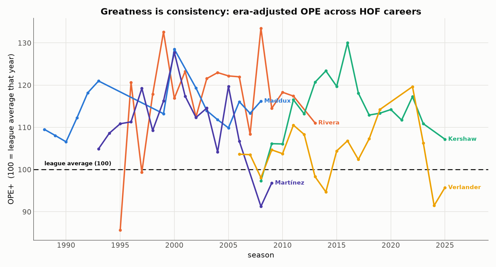
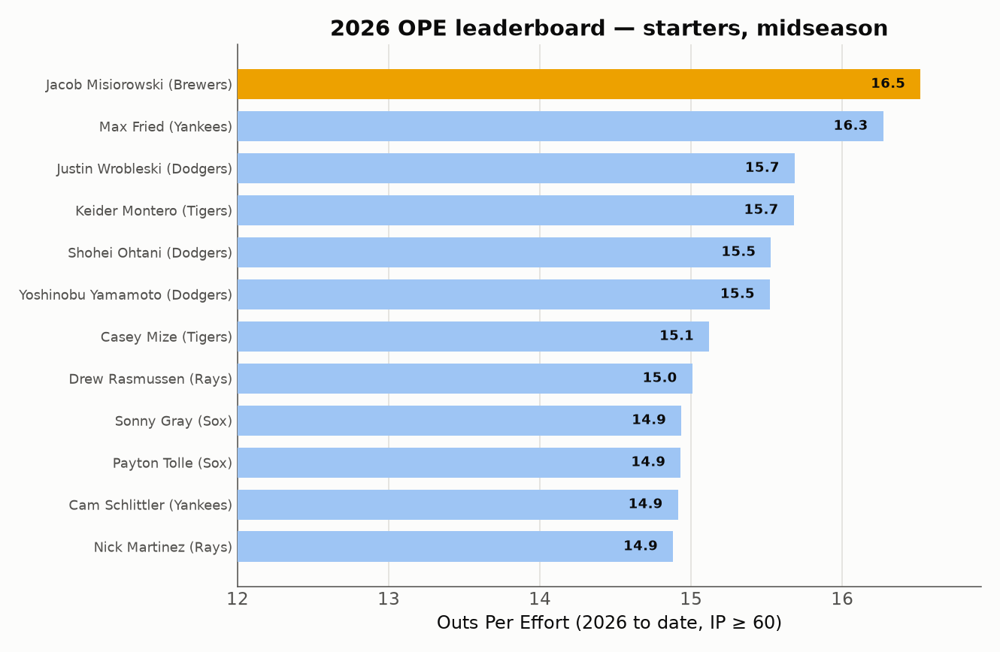

# Outs Per Effort (OPE)：一個好懂、好算，又看得到 ERA 盲點的投手指標

*作者：Chung-Hao Lee · 一個棒球數據的業餘 side project*
*資料：MLB 官方 Stats API，2023–2025（約 1,000 個投手球季，IP ≥ 50）· [English →](README.md)*

---

2023 年，Blake Snell 以亮眼的 2.25 ERA 拿下國聯賽揚獎。但同一年，他也投出全聯盟最多的保送，平均每局要用掉 17.6 顆球。而在同一條海岸線的北邊，Logan Webb 默默投了 216 局猛攻好球帶、大量滾地球的內容，ERA 卻是高出整整一分的 3.25。

用大家都懂的那個數字看，Snell 是全聯盟最強。但他是**最有效率**的嗎？你的直覺會說不是。**問題在於：我們最簡單的指標，說不出「為什麼不是」。**

這正是我想補上的缺口——而且要用一個你在腦中就能算出來的數字。

那個數字就是 **Outs Per Effort（OPE）**，它建立在一個念頭上：*投手的工作是「買」出局，而我們該衡量他買得多便宜。* 本文會從這一句話把 OPE 建出來，再讓它通過四道測驗——它對每種投手都**公平**嗎？它**準**嗎？它看得到 **ERA 看不到的東西**嗎？它能**跨越生涯與年代**站得住嗎？若都通過，我們就得到一個和 ERA 一樣簡單、卻誠實得多的指標。

## 我們一直在做的取捨

評價一位投手，通常得在兩種指標之間二選一。

**ERA** 人人都懂、簡單，卻有一個盲點：它只在乎跑者**有沒有回來得分**，不在乎你被打得多慘。一局被打穿全場、最後靠雙殺化解，和三上三下，在 ERA 眼裡一模一樣；一支扎實的二壘安打和一支運氣的一壘安打，只要跑者沒回來得分，帳面上也沒差別。ERA 看得到結果，看不到過程。

**進階指標**（wRC+、SIERA、xFIP）修好了準確度，卻是多數球迷眼中的黑盒子。你沒辦法在餐巾紙上推導出來，只能照單全收。

我想要的，是一個**簡單到能手算、又誠實到能反映投手真正內容**的東西。

## 一個借自《魔球》的第一性原理

靈感來自撐起《魔球》的那個洞見：棒球場上最稀缺的資源是**出局**。每隊剛好只有 27 個，在第 27 個出局到來前得分多的一方獲勝。這也是當年運動家最看重上壘率的原因——它衡量打者「在出局之前上壘」的能力。

有趣的是，這種「出局優先」的視角幾乎只用在打者身上；輪到評價投手，招牌指標（ERA、FIP）全繞著**失分**打轉。那就把它反過來。把投手的工作想成一筆交易：

> **他要買的：出局。**
> **他要付的：兩種成本。**

1. **球數——力氣成本。** 每場約 100 球的預算，用越少球解決打者，就投越深、越省牛棚。
2. **壘打數——損害成本。** 每讓一個壘包，就離失分更近；而全壘打（4 壘打）的損害是一壘安打（1 壘打）的四倍。這正是 ERA 丟掉的資訊。

兩種成本，同一個目標。把它們算進同一張帳單，指標就出來了。

## 公式

$$\Large OPE = \frac{100 \times \text{outs}}{\text{pitches} + 4 \times \text{TB}}$$

出局數、投球數、被打壘打數——三個從 box score 就能拿到的數字，一行算式。而那個 `4`，有一句任何球迷都記得住的翻譯：

> ### 每被取得一個壘包，就像白投了四顆球。

**一個 30 秒的例子。** 兩位後援各投一局**無失分**的內容：3 出局、15 球，各被打一支、但都在失分前被化解。帳面一模一樣，ERA 都是 0.00。唯一差別是被打的那支是什麼：

| | 出局 | 球數 | 被打 | 失分 | OPE |
|---|:--:|:--:|:--:|:--:|:--:|
| 投手 A — 一壘安打（殘壘） | 3 | 15 | 1 壘打 | 0 | 300 / (15 + 4×1) = **15.8** |
| 投手 B — 二壘安打（殘壘） | 3 | 15 | 2 壘打 | 0 | 300 / (15 + 4×2) = **13.0** |

一樣的出局、一樣的球數、一樣的 ERA，但 OPE 知道 B 讓出的損害更多，把他從「優秀」拉到平均以下。這就是整個概念的縮影：**OPE 在損害發生的當下就記帳，不管它最後有沒有得分。**（一整季下來這些小差距會累積，而全壘打——4 個壘打——被懲罰得比一壘安打重四倍。）

### 為什麼是 4？

這個權重不是隨手挑的——它同時通過兩道關卡。

- **棒球論證**：聯盟平均一局約 15–16 球、讓出約 1.4 個壘打。要讓損害這一項在帳單裡有份量（而不是被龐大球數淹沒），一個壘包大約要值 4 顆球。
- **數學論證**：下圖左側顯示，隨權重改變，OPE 與投球局數的相關性也跟著變。**這條線剛好在 4 附近穿過零**——「一個壘包 ≈ 4 顆球」同時正好是讓 OPE **與工作量脫鉤**的值（下一節詳談為何重要）。

而且很穩健：權重從 2 到 6，排行榜幾乎不動（Spearman 排名相關 ≥ 0.97）。結論不是靠精調常數湊出來的。

## 測驗一：OPE 對先發與後援一視同仁

好的效率指標，不該因為你投得多或少就偷偷加減分。200 局的先發和 60 局的後援，應該站在同一條線上比。

因為 OPE 的分子（出局）和分母（球數＋壘打）都隨局數成長，工作量在比值中約分掉：

OPE 與投球局數的相關性只有 **−0.02——形同零**。後援（橘）與先發（藍）交織在一起，趨勢線是平的。OPE 衡量的是效率本身，不是你在場上多久。

## 測驗二：OPE 真的反映投手實力

公平還不夠，準才是重點。若 OPE 有意義，OPE 越好，成績就該越好——ERA 更低、對手打擊線更弱。那就把每個投手球季按 OPE 分級，看看每一級實際打出什麼結果：

階梯完美：OPE 每升一級，平均 ERA 就下降——從最低級慘烈的 5.80，一路降到頂級亮眼的 2.44，被打 OPS 同步下滑。換句話說，OPE 與 ERA 相關 −0.82、與被打 OPS 相關 −0.89。而且不只這兩個——把 OPE 對上各種公認的防止失分指標，關係全面成立：

被打 OPS、WHIP、ERA、FIP、被全壘打率，OPE 全都抓得緊。但看最下面那條：**OPE 和三振率（K/9）只有微弱的 +0.18。** 這不是缺點，反而是最有意思的地方：

> **OPE 不是三振的變裝。**

因為它獎勵的是**經濟性**與**壓制接觸品質**，而不只是製造揮空。潛水艇 **Tyler Rogers** 在 2025 年每九局只三振 5.6 人——全聯盟末段的「揮空能力」——卻繳出 **17.5 的 OPE**，是全體投手數一數二的成績，因為他每局只用 12.7 球、幾乎不讓壘包。滾地球大師 **Framber Valdez**（15.5）與精準的 **Cristopher Sánchez**（15.7）也是同樣的故事。三振至上的視角常低估這些手臂，OPE 不會——這條傳統從 Jamie Moyer、Mark Buehrle 一路延續到 Dan Haren，這些軟投投手用整個生涯證明：不靠球速，一樣可以很有效率。

## 刻度：多高才算好？

每個指標都需要一把尺。取自 2023–2025 完整分佈：

| 分級 | OPE | 意義 |
|---|:--:|---|
| 🟦 **頂尖 Elite** | ≥ 15.0 | 前 10%，賽揚等級 |
| 🔵 **優秀 Good** | 14.2 – 15.0 | 前 25%，可靠先發／高信任後援 |
| ⚪ **平均 Average** | ≈ 13.4 | 聯盟中位數 |
| 🔸 **中下** | 12.7 – 13.4 | 後段輪值／中繼 |
| 🔻 **掙扎** | < 12.2 | 後 10% |

記三個錨點就夠：**15 是頂尖、13.4 是平均、12 以下要當心。**（這把尺穩嗎？2023、2024、2025 三年的聯盟平均 OPE 分別是 13.05、13.32、13.26——上下不到 0.25，所以把近三季合併成一把尺是安全的。但跨到數十年前，基準會漂移較多，這也正是後面的傳奇比較改用「年代校正版」的原因。）

## 排行榜：OPE 選出來的是誰？

**2023–2025 單季 OPE 前 15 名（IP ≥ 50）**

| # | 投手 | 年 | 隊 | 角色 | IP | ERA | OPE |
|:--:|---|:--:|:--:|:--:|:--:|:--:|:--:|
| 1 | Emmanuel Clase | 2024 | CLE | 後援 | 74.1 | 0.61 | **18.8** |
| 2 | Raisel Iglesias | 2024 | ATL | 後援 | 69.1 | 1.95 | **17.9** |
| 3 | Adrian Morejón | 2025 | SD | 後援 | 73.2 | 2.08 | **17.7** |
| 4 | Tyler Rogers | 2025 | NYM | 後援 | 77.1 | 1.98 | **17.5** |
| 5 | Aroldis Chapman | 2025 | BOS | 後援 | 61.1 | 1.17 | **17.0** |
| 6 | Ryan Helsley | 2024 | STL | 後援 | 66.1 | 2.04 | **16.7** |
| 7 | Brusdar Graterol | 2023 | LAD | 後援 | 67.1 | 1.20 | **16.7** |
| 8 | Tyler Holton | 2024 | DET | 後援 | 94.1 | 2.19 | **16.6** |
| … | | | | | | | |
| 13 | **Trevor Rogers** | 2025 | BAL | **先發** | 109.2 | 1.81 | **16.2** |

榜首清一色是頂級後援與守護神——完全符合直覺。全體最高的**先發**是 2025 年爆發的 Trevor Rogers。若只看先發：

**2023–2025 先發投手 OPE 前 6 名**

| # | 投手 | 年 | 隊 | IP | ERA | OPE |
|:--:|---|:--:|:--:|:--:|:--:|:--:|
| 1 | Trevor Rogers | 2025 | BAL | 109.2 | 1.81 | **16.2** |
| 2 | Cristopher Sánchez | 2025 | PHI | 202.0 | 2.50 | **15.7** |
| 3 | Nathan Eovaldi | 2025 | TEX | 130.0 | 1.73 | **15.7** |
| 4 | Bryan Woo | 2024 | SEA | 121.1 | 2.89 | **15.6** |
| 5 | **Tarik Skubal** | 2025 | DET | 195.1 | 2.21 | **15.6** |
| 6 | Framber Valdez | 2024 | HOU | 176.1 | 2.91 | **15.5** |

背靠背賽揚得主 **Tarik Skubal** 三個球季都在先發榜前段——指標指對人的好徵兆。而且不只個人：放大到整支投手群，水手、光芒、釀酒人、教士、費城人升到最上面——正是以培養投手聞名的球團——墊底的則是落磯（你好，Coors Field）、白襪、國民。這裡沒有任何會讓你意外的東西，而這正是重點：一個新指標，要先同意我們已知的常識，才有資格告訴我們未知的事。

### OPE 看得到、ERA 看不到的東西

看這兩位先發：

| 投手 | 年 | ERA | OPE | 分級 |
|---|:--:|:--:|:--:|---|
| Tyler Glasnow | 2024 | 3.49 | **15.0** | 頂尖 |
| Charlie Morton | 2023 | 3.64 | **13.1** | 中下 |

**在 ERA 眼裡他們幾乎是雙胞胎。** OPE 卻在兩人間拉開一整級。差別在過程：Glasnow 用壓倒性球威解決打者、幾乎不讓壘包；Morton 投得辛苦、被取得的壘包多得多，卻換到相近的 ERA。ERA 看到兩個相似的結果，OPE 看到兩個截然不同的投手——這就是重點，也帶出全文最嚴苛的一道測驗。

## 測驗三：看見 ERA 看不到的——OPE vs 投票者

如果 OPE 真的抓到 ERA 漏掉的東西，它就該偶爾和這項運動的官方認定**唱反調**——而且唱得有道理。我把 2023–2025 每位賽揚得主，放回他們**自己聯盟**的 OPE 排名裡。

對**效率碾壓型**的得主，OPE 和記者完全同步：Skubal 兩年都在美聯先發榜頂端，Cole 2023 也在前段。這些都是宰制級又省球的球季，OPE 也這麼說。

然後是**開頭那位 Blake Snell，2023**——全榜最大的分歧。OPE 只把他排在國聯先發第 14。原因就在下表，和 OPE 改選的那個人並排來看：

| 2023 NL | IP | ERA | FIP | 保送 | 每局球數 | OPE |
|---|:--:|:--:|:--:|:--:|:--:|:--:|
| Blake Snell（賽揚） | 180.0 | 2.25 | 3.38 | **99** | **17.6** | 13.86 |
| Logan Webb（OPE 之選） | 216.0 | 3.25 | 3.10 | **31** | **14.7** | 14.75 |

兩人用差不多的球數，Webb 卻多投 36 局、保送只有三分之一、FIP 更好。Snell 的 ERA 較低——他極擅長化解自己製造的危機——但在每一個**過程**指標上，Webb 都更有效率，連 FIP 都站在 OPE 這邊而非 ERA。**這是 OPE 價值最清楚的一次示範：它評的是投球內容，不只是計分板。**

## 測驗四：偉大即一致

單季快照是一回事，真正把名人堂與其他人分開的，是**年年做到**。但這裡有個陷阱：得分環境會隨年代改變，所以原始 OPE 沒辦法把 1990 年代和今天直接相比（過去 35 年，聯盟平均 OPE 從約 12.7 到 14.6 都有）。要誠實地追蹤生涯，我們把每一季都對照它自己的聯盟：**OPE+**，其中 100 代表當年聯盟平均，115 就是「比全聯盟好 15%」。

| 投手 | 生涯 OPE+ | 期間 |
|---|:--:|:--:|
| Mariano Rivera | **117** | 1995–2013 |
| Greg Maddux | **115**（±6） | 1988–2008 |
| Clayton Kershaw | 114 | 2008–2025 |
| Pedro Martínez | 111 | 1993–2009 |
| Justin Verlander | 104 | 2006–2025 |

這些手臂每一位都在聯盟線**之上**待了 **15 到 20 個球季**——名人堂的印記。Mariano Rivera 在長達二十年的後援生涯裡，穩定地比聯盟平均高 17%。而 Greg Maddux——恰如其分地，正是「用球效率」的守護神——OPE+ 115、標準差只有 6，意思是他幾乎沒有不優秀的時候。**持續、贏過年代的 OPE，原來是偉大的指紋。**

## 2026 追蹤

2026 球季走完約 55%，先發榜目前如下：

目前 OPE 最有效率的先發是釀酒人新秀怪物 **Jacob Misiorowski**（16.5、1.62 ERA）。值得注意的是，背靠背衛冕的 Skubal 今年 OPE 掉到第 25（3.06 ERA）——相對他巔峰是實實在在的回檔。

**一個誠實的提醒：** OPE 是**描述性**指標，不是水晶球。年度之間它的穩定度和 ERA 差不多（都在 0.2 上下），所以這張榜請讀成「目前為止誰投得最有效率」，而不是鎖定的預測。想預測，請搭配 FIP、xFIP。

## OPE 是什麼、不是什麼

- **它描述，不預測。** OPE 抓的是這個球季有多有效率，適合評價，不適合單獨拿來預測明年。
- **權重 4 是一個建模選擇**——有紮實依據、在寬範圍內穩健，但終究是選擇。
- **原始 OPE 不做場地與對手校正**（跨年代比較時，我們改用上面的 OPE+）。它是原始效率，不像 ERA-、FIP- 針對 Coors Field 或聯盟環境調整過。
- **小樣本仍會震盪。** 本文一律 IP ≥ 50；再少，任何比率指標（包括 OPE）都會大幅波動。

## 結論

Outs Per Effort 用一道最樸素的除法，回答投球最根本的問題：**這位投手，花了多少代價，買到了多少出局？**

- **簡單**——出局 ÷（球數 ＋ 每壘包算四球），腦中可算。
- **透明**——三個 box score 數字，沒有黑盒子。
- **貼近實力**——與 ERA、OPS、WHIP 同動；全壘打自動比一壘安打重四倍；先發後援一視同仁；還抓得到三振至上視角會錯過的效率型手臂。

它不會、也不打算取代 wRC+ 或 SIERA。但如果你想要一個能在餐巾紙上算出來、又真的能說出投手內容好壞的數字——OPE 就是那個數字。

---

### 方法與可複驗

本文一切都可由這個 repo 複現：

- **資料**——[`data/`](data/)：由公開的 MLB Stats API（`statsapi.mlb.com`）抓取的例行賽投球資料，2023–2025 加上 2026 至今、傳奇投手生涯逐年，以及各年度聯盟總計（供 OPE+ 校正）。
- **自己抓**——[`scripts/fetch_pe_data.py`](scripts/fetch_pe_data.py)（`python3 fetch_pe_data.py 2026`）、[`scripts/fetch_legends.py`](scripts/fetch_legends.py)、[`scripts/fetch_history.py`](scripts/fetch_history.py)。只用 Python 內建庫，零依賴。
- **重算與重繪**——[`scripts/analyze_pe.py`](scripts/analyze_pe.py) 與 [`scripts/make_charts.py`](scripts/make_charts.py)（pandas + matplotlib）。

樣本：IP ≥ 50 的投手球季（2023–2025 約 1,000 個）。`outs` 與 `TB` 直接取自 API；FIP 以各季聯盟常數校正；OPE+ 以各年度全聯盟 OPE 為基準。2022 年最初的原型保存在 [`archive/`](archive/)。
