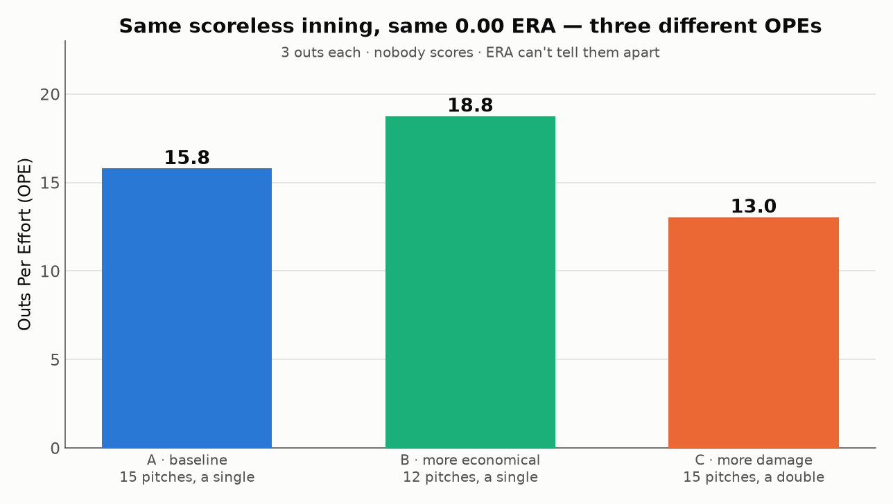
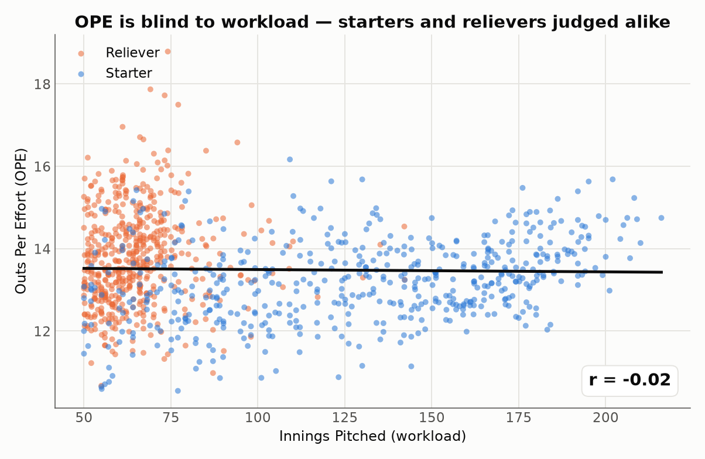
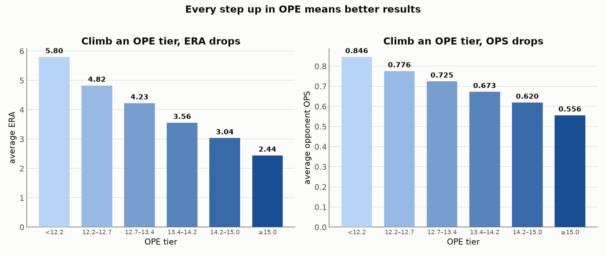
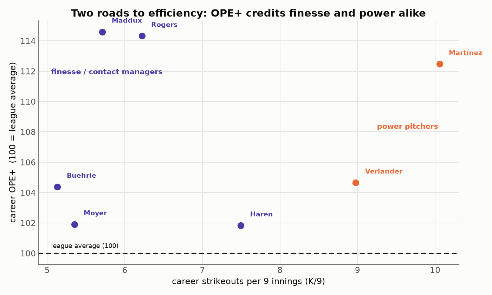
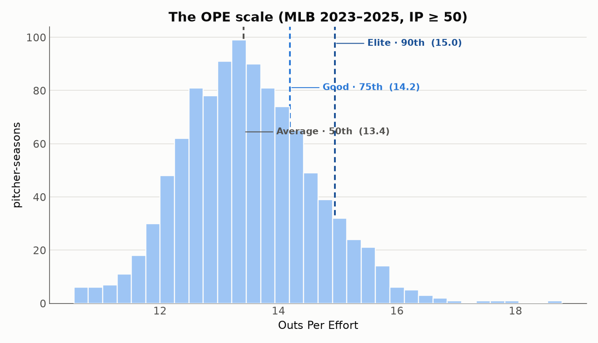
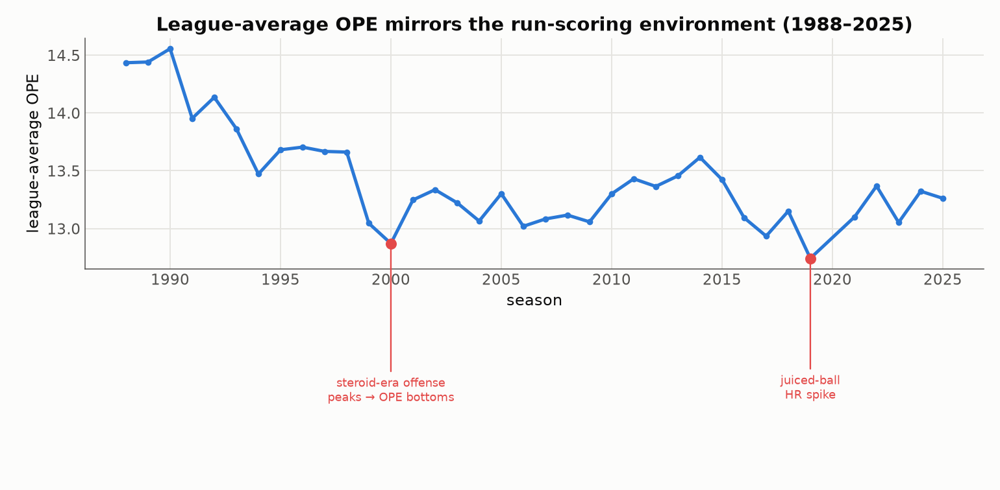
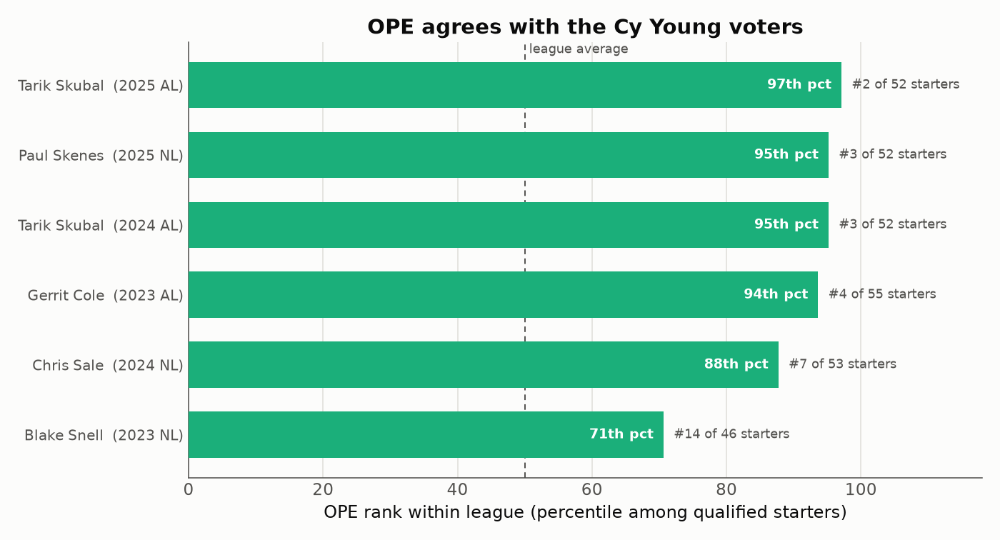
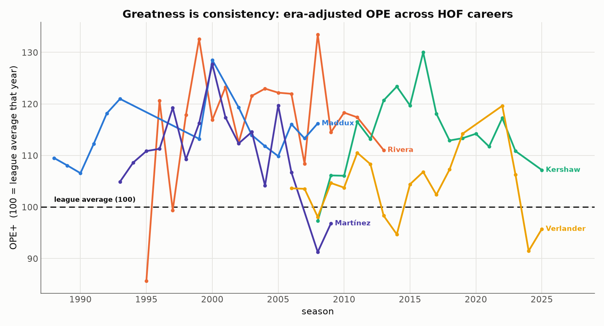

# Outs Per Effort (OPE): a simple pitching stat that sees what ERA misses

*By Chung-Hao Lee*
*Data: MLB Stats API, 2023–2025 (≈1,000 pitcher-seasons, IP ≥ 50) · [中文版 →](README.cn.md)*

---

Greg Maddux made an art form out of the cheap out. In his prime he would finish a complete game with his pitch count still in the 80s — barely a strikeout in sight, just soft contact and quick innings — and the feat became so linked to him that a complete-game shutout on under 100 pitches is now simply called a *Maddux*.

We have always admired that kind of pitching. What we have never quite had is a *number* for it — a clean way to say how efficiently a pitcher turns his work into outs. ERA counts the runs that scored; strikeout rate counts the bats he missed; neither quite captures the thing Maddux did best.

This piece is about a stat that tries to — and one you can work out in your head. It's called **Outs Per Effort (OPE)**, and it rests on a single idea: *a pitcher's job is to buy outs, and we can measure how cheaply he buys them.* The rest of this piece builds OPE from that one sentence, then puts it through four tests — is it **fair** to every kind of pitcher, is it **accurate**, does it **agree with how the game already crowns its best**, and does it **hold up across careers and eras?** Along the way it also does something the familiar stats don't: it finally puts a number on pitchers like Maddux. If it passes, we'll have a stat as easy as ERA with a wider field of view.

## The trade-off we keep making

Evaluating a pitcher usually means choosing between two kinds of stats.

**ERA** is universal and simple, but it has one blind spot: it only cares whether runners *scored*, not how hard you were hit. An inning where you're barreled all over the yard but escape on a double play looks identical to a 1-2-3 frame. A screaming double and a bloop single count the same to ERA, as long as the runner never comes around. ERA sees the result, never the process.

The **advanced stats** — wRC+, SIERA, xFIP — fix the accuracy problem, but they're black boxes to most fans. You can't derive them on a napkin, so you take them on faith.

I wanted something that is **simple enough to compute by hand, yet honest enough to reflect how a pitcher actually pitched.**

## A first principle, borrowed from *Moneyball*

The idea starts with the insight that anchored *Moneyball*: the scarcest resource in baseball is the **out**. Each team gets exactly 27 of them, and whoever scores more before the 27th wins. It's why the A's prized on-base percentage — a measure of reaching base *before* making an out.

Curiously, that out-first lens is aimed almost entirely at hitters. When we grade pitchers, our marquee stats (ERA, FIP) all orbit around **runs**. So let's flip it. Think of a pitcher's job as a transaction:

> **What he's buying: outs.**
> **What he pays: two kinds of cost.**

1. **Pitches — the cost of effort.** A pitcher has a budget of roughly 100 pitches a night. The fewer he spends per out, the deeper he goes and the more bullpen he saves.
2. **Total bases — the cost of damage.** Every base he surrenders moves the opponent closer to scoring, and a home run (four bases) does four times the damage of a single (one base). This is exactly the distinction ERA throws away.

Two costs, one goal. Put them on the same bill, and you get the metric.

## The formula

$$\Large OPE = \frac{100 \times \text{outs}}{\text{pitches} + 4 \times \text{TB}}$$

Outs, pitches thrown, total bases allowed — three numbers off any box score, one line of arithmetic. The best way to read it is backwards: the denominator is the **total cost** a pitcher pays — every pitch he throws, plus a penalty for every base he gives up — and OPE asks how many outs he squeezed out of that cost. It is, quite literally, an **efficiency**: outs produced per unit of effort spent, scaled so that *higher is better*. (That `100` is just there to land the numbers in a friendly range.)

The `4` has a one-sentence translation any fan can hold onto:

> ### Every base you give up costs you like four wasted pitches.

So a single is worth about four squandered pitches; a home run, sixteen — roughly a full batter's worth of work. **Home runs are punished four times as hard as singles, automatically — the thing ERA can't do.**

### Why four?

The weight isn't arbitrary — it clears two independent bars.

- **The baseball argument.** A league-average inning runs about 15–16 pitches and surrenders roughly 1.4 bases. For the damage term to carry real weight in the bill (instead of drowning under the pitch count), a base has to be worth about four pitches.
- **The math argument.** The chart below (left) tracks how OPE correlates with innings pitched as the weight changes. **That line crosses zero right around 4** — meaning "a base ≈ four pitches" is also precisely the value that makes OPE *independent of workload* (more on why that matters next).

And it's robust: for any weight from 2 to 6, the leaderboard barely moves (Spearman rank agreement ≥ 0.97). The result isn't an artifact of a hand-tuned constant.

### See it in one inning

That's the theory; here's the feel of it. Picture three relievers who each throw a *scoreless* inning — 3 outs, nobody scores, an identical 0.00 ERA. To ERA they are triplets. Watch OPE pull them apart:

- **Pitcher A** needs 15 pitches and gives up a harmless single → OPE **15.8**. Our baseline.
- **Pitcher B** does the same job on *12 pitches* → OPE **18.8**. He was more **economical**, so he rates higher.
- **Pitcher C** also uses 15 pitches, but the hit he allows is a *double* → OPE **13.0**. Same effort, more **damage**, so he rates lower.

That's the whole metric in one picture: reward the pitcher who spends fewer pitches, penalize the one who concedes more bases — even when the scoreboard, and ERA, can't tell any of them apart.

## Test 1 — OPE is fair to starters and relievers alike

A good efficiency stat shouldn't quietly reward you for pitching *more* or *less*. A 200-inning starter and a 60-inning reliever should stand on the same line.

Because OPE's numerator (outs) and denominator (pitches + bases) both scale with innings, workload cancels out of the ratio:

The correlation between OPE and innings pitched is **−0.02 — effectively zero.** Relievers (orange) and starters (blue) intermingle, and the trend line is flat. OPE measures efficiency itself, not how long you were on the mound.

## Test 2 — OPE tracks how good a pitcher actually is

Fairness is nice; accuracy is the point. If OPE means anything, better OPE should translate into better results — lower ERAs, weaker opponent hitting lines. So let's sort every pitcher-season into OPE tiers and look at what each tier actually produced:

The staircase is perfect: each step up in OPE drops the average ERA, from a brutal 5.80 in the bottom tier to a sparkling 2.44 at the top, with opponent OPS falling in lockstep. Put another way, OPE correlates with ERA at −0.82 and with opponent OPS at −0.89. And it isn't just those two — line OPE up against every standard measure of run prevention and the relationship holds across the board:

Opponent OPS, WHIP, ERA, FIP, home-run rate — OPE tracks all of them tightly. But look at the bottom bar: **OPE's tie to strikeout rate (K/9) is a weak +0.18.** That's not a bug — it's the most interesting thing about the stat.

## The pitchers OPE finally lets us appreciate

Most of our best pitching stats lean, directly or indirectly, on missing bats. That leaves a whole tradition of pitcher underserved: the soft-tossers who rarely strike anyone out, but let hitters make contact *badly* — weak grounders and lazy flies that turn into outs. We always sort of knew these guys were useful. We never had a clean number for it.

OPE does. Because it rewards economy and contact management rather than swing-and-miss, it puts real value on exactly what these pitchers do. Take submariner **Tyler Rogers**: in 2025 he struck out just 5.6 per nine — bottom-of-the-league bat-missing — yet posted a **17.5 OPE**, one of the best marks in baseball, because he needed only 12.7 pitches an inning and gave up next to nothing.

Zoom out over full careers (era-adjusted to **OPE+**, where 100 is the league average — more on that later), and the pattern is striking:

Jamie Moyer and Mark Buehrle each struck out barely five per nine — half the rate of a modern power arm — and still finished *above* the league line for two decades apiece (OPE+ 102 and 104). And there in the same low-strikeout neighborhood sits **Greg Maddux** (OPE+ 115), the greatest command artist of them all, level with the flame-throwing Pedro Martínez (112). **There are two roads to efficiency — overpower the hitter, or never let him square it up — and OPE is one of the few stats that honors both.**

## The scale: how high is good?

Every stat needs a ruler. From the full 2023–2025 distribution:

| Tier | OPE | Meaning |
|---|:--:|---|
| 🟦 **Elite** | ≥ 15.0 | top 10% — Cy Young class |
| 🔵 **Good** | 14.2 – 15.0 | top 25% — a dependable starter or high-leverage reliever |
| ⚪ **Average** | ≈ 13.4 | the league median |
| 🔸 **Below average** | 12.7 – 13.4 | back-of-rotation / middle relief |
| 🔻 **Struggling** | < 12.2 | bottom 10% |

Three anchors are enough to carry in your head: **15 is elite, 13.4 is average, below 12 is trouble.**

Is this ruler stable? Across 2023, 2024 and 2025 the league-average OPE was 13.05, 13.32 and 13.26 — steady to within a quarter-point, so pooling three recent seasons into one scale is safe. But zoom all the way out and the baseline does move:

League-average OPE tracks the run-scoring environment in reverse: it bottomed out around the steroid-era offensive peak of 2000, dipped again during the juiced-ball home-run surge of 2019, and rises whenever offense cools. Over 35 years it has swung from about 12.7 to 14.6 — a real gap, and the reason the career comparisons later switch to an era-adjusted version.

## The leaderboard: who does OPE love?

**Top 15 pitcher-seasons, 2023–2025 (IP ≥ 50)**

| # | Pitcher | Year | Team | Role | IP | ERA | OPE |
|:--:|---|:--:|:--:|:--:|:--:|:--:|:--:|
| 1 | Emmanuel Clase | 2024 | CLE | RP | 74.1 | 0.61 | **18.8** |
| 2 | Raisel Iglesias | 2024 | ATL | RP | 69.1 | 1.95 | **17.9** |
| 3 | Adrian Morejón | 2025 | SD | RP | 73.2 | 2.08 | **17.7** |
| 4 | Tyler Rogers | 2025 | NYM | RP | 77.1 | 1.98 | **17.5** |
| 5 | Aroldis Chapman | 2025 | BOS | RP | 61.1 | 1.17 | **17.0** |
| 6 | Ryan Helsley | 2024 | STL | RP | 66.1 | 2.04 | **16.7** |
| 7 | Brusdar Graterol | 2023 | LAD | RP | 67.1 | 1.20 | **16.7** |
| 8 | Tyler Holton | 2024 | DET | RP | 94.1 | 2.19 | **16.6** |
| … | | | | | | | |
| 13 | **Trevor Rogers** | 2025 | BAL | **SP** | 109.2 | 1.81 | **16.2** |

The top of the board is elite relievers and closers — exactly the faces you'd expect. The highest-ranked **starter** is 2025's breakout Trevor Rogers. Among starters only:

**Top starters by OPE, 2023–2025**

| # | Pitcher | Year | Team | IP | ERA | OPE |
|:--:|---|:--:|:--:|:--:|:--:|:--:|
| 1 | Trevor Rogers | 2025 | BAL | 109.2 | 1.81 | **16.2** |
| 2 | Cristopher Sánchez | 2025 | PHI | 202.0 | 2.50 | **15.7** |
| 3 | Nathan Eovaldi | 2025 | TEX | 130.0 | 1.73 | **15.7** |
| 4 | Bryan Woo | 2024 | SEA | 121.1 | 2.89 | **15.6** |
| 5 | **Tarik Skubal** | 2025 | DET | 195.1 | 2.21 | **15.6** |
| 6 | Framber Valdez | 2024 | HOU | 176.1 | 2.91 | **15.5** |

Back-to-back Cy Young winner **Tarik Skubal** lands in the top of the starter board all three seasons — a reassuring sign the stat points at the right people. And it isn't only individuals: zoom out to whole staffs and the Mariners, Rays, Brewers, Padres and Phillies rise to the top — the very organizations known for developing pitching — while the Rockies (hello, Coors Field), White Sox and Nationals sit at the bottom. Nothing there will surprise you, which is the point: a new stat should agree with what we already know before it tells us something we don't.

### What OPE sees that ERA doesn't

Consider two starters:

| Pitcher | Year | ERA | OPE | Tier |
|---|:--:|:--:|:--:|---|
| Tyler Glasnow | 2024 | 3.49 | **15.0** | Elite |
| Charlie Morton | 2023 | 3.64 | **13.1** | Below average |

**To ERA, they're near-twins.** OPE puts a full tier between them: Glasnow overpowered hitters and gave up almost nothing, while Morton worked harder for the same bottom-line ERA. Same result, different process — and reading that difference is exactly the dimension OPE is built to add.

## Test 3 — does OPE agree with how we crown the best?

A brand-new stat earns trust not by overturning the experts, but by recognizing the same greatness they do. So I pulled every Cy Young winner from 2023–2025 and checked where each ranked in his own league by OPE:

The verdict is reassuring: every winner ranks among the most efficient starters in his league — most of them in the 90th percentile or better, all of them well above average. When the writers hand out the hardware, OPE is nodding along.

What makes OPE worth having is that it adds a *distinct* lens rather than a redundant one — and the closest Cy Young race in recent memory shows how. In 2012 the AL award came down to two of the era's best seasons, David Price and Justin Verlander:

| 2012 AL | ERA | IP | K | WHIP | OPE |
|---|:--:|:--:|:--:|:--:|:--:|
| David Price (winner) | 2.56 | 211.0 | 205 | 1.10 | **14.69** |
| Justin Verlander | 2.64 | 238.1 | 239 | 1.06 | **14.47** |

Three great stats, three angles on the same brilliant pair. ERA gives Price the narrowest of edges. WAR leans toward Verlander, rewarding his extra 27 innings and 34 strikeouts. And OPE — a pure efficiency rate — lands with Price too: pitch for pitch, base for base, he was a shade more economical. None of them is "right," because they answer different questions. WAR asks *how much value* a pitcher piled up; OPE asks *how efficiently* he worked. **OPE doesn't replace ERA or WAR — it pulls up a chair and adds the efficiency seat to the table**, and here it happens to agree with the voters' call.

## Test 4 — greatness is consistency

A one-season snapshot is one thing; the inner circle does it *every year*. But as we just saw, the run-scoring environment shifts across eras, so raw OPE isn't comparable between the 1990s and today. To trace careers honestly, we index each season to its own league: **OPE+**, where 100 is that year's league average and 115 means "15% better than the field."

| Pitcher | Career OPE+ | Span |
|---|:--:|:--:|
| Mariano Rivera | **117** | 1995–2013 |
| Greg Maddux | **115** (±6) | 1988–2008 |
| Clayton Kershaw | 114 | 2008–2025 |
| Pedro Martínez | 111 | 1993–2009 |
| Justin Verlander | 104 | 2006–2025 |

Every one of these arms lived *above* the league line for **fifteen to twenty seasons straight** — the mark of a Hall-of-Famer. Mariano Rivera sat 17% above average across two decades of relief. And Greg Maddux — fittingly, the patron saint of pitch efficiency — posted a 115 OPE+ with a standard deviation of just 6, meaning he was almost never anything but excellent. Sustained, era-beating OPE turns out to be a fingerprint of greatness.

## The 2026 watch

With the 2026 season about 55% complete (2026-07-10), here's the starter leaderboard so far:

OPE's most efficient starter to date is Brewers rookie phenom **Jacob Misiorowski** (16.5, 1.62 ERA). Notably, two-time defending Cy Young winner Skubal has slipped to 25th in OPE this year (3.06 ERA) — a real, measurable step back from his back-to-back peak.

**One honest caveat:** OPE is a *descriptive* stat, not a crystal ball. Year-to-year it's about as stable as ERA (both hover near 0.2), so read this board as "who has pitched most efficiently so far," not a locked-in prediction. If you want to forecast, pair OPE with FIP and xFIP.

## What OPE is — and isn't

- **It describes; it doesn't predict.** OPE captures how efficient a pitcher *was* this season. Use it to evaluate, not to project next year on its own.
- **The weight of 4 is a modeling choice** — well-grounded, and robust across a wide range, but a choice.
- **Raw OPE has no park or opponent adjustment** (for cross-era comparisons we use OPE+ above). It isn't scaled for Coors Field or league run environment the way ERA- and FIP- are.
- **Small samples stay noisy.** Everything here uses IP ≥ 50; below that, OPE (like any rate stat) swings wildly.

## The bottom line

Outs Per Effort answers the most basic question in pitching with one plain division: **how many outs did this pitcher buy, and how much did he pay?**

- **Simple** — outs ÷ (pitches + four per base), computable in your head.
- **Transparent** — three box-score numbers, no black box.
- **Descriptive** — it moves with ERA, OPS, and WHIP; it charges four times as much for a homer as a single; it judges starters and relievers alike; and it finally puts a number on the finesse artists a strikeout-first view walks right past.

It won't replace wRC+ or SIERA, and it isn't trying to. But if you want a number you can work out on a napkin that still tells you something true about how a pitcher pitched — OPE is that number.

---

### Methodology & reproducibility

Everything here is reproducible from this repo:

- **Data** — [`data/`](data/): raw pitching lines from the public MLB Stats API (`statsapi.mlb.com`) — regular season 2023–2025 plus 2026-to-date, Hall-of-Fame and finesse career lines, and per-season league totals used for the OPE+ baseline.
- **Fetch it yourself** — [`scripts/fetch_pe_data.py`](scripts/fetch_pe_data.py) (`python3 fetch_pe_data.py 2026`), [`scripts/fetch_legends.py`](scripts/fetch_legends.py), and [`scripts/fetch_history.py`](scripts/fetch_history.py). Standard library only, no dependencies.
- **Recompute & re-plot** — [`scripts/analyze_pe.py`](scripts/analyze_pe.py) and [`scripts/make_charts.py`](scripts/make_charts.py) (pandas + matplotlib).

Sample: pitcher-seasons with IP ≥ 50 (≈1,000 across 2023–2025). `outs` and `TB` come straight from the API; FIP uses a per-season constant so league FIP equals league ERA; **OPE+** indexes each season to that year's league-wide OPE. The original 2022 prototype of this idea is preserved in [`archive/`](archive/).
