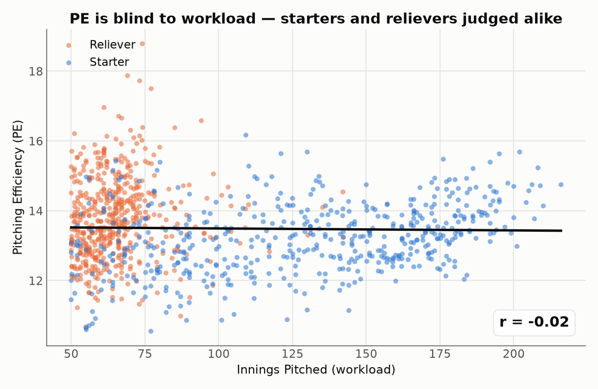
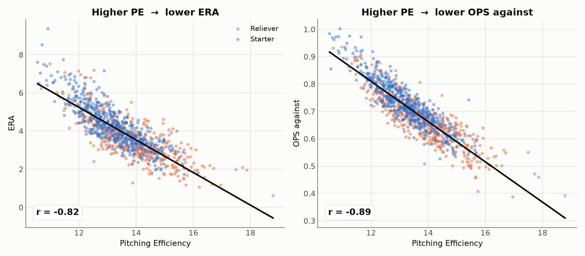
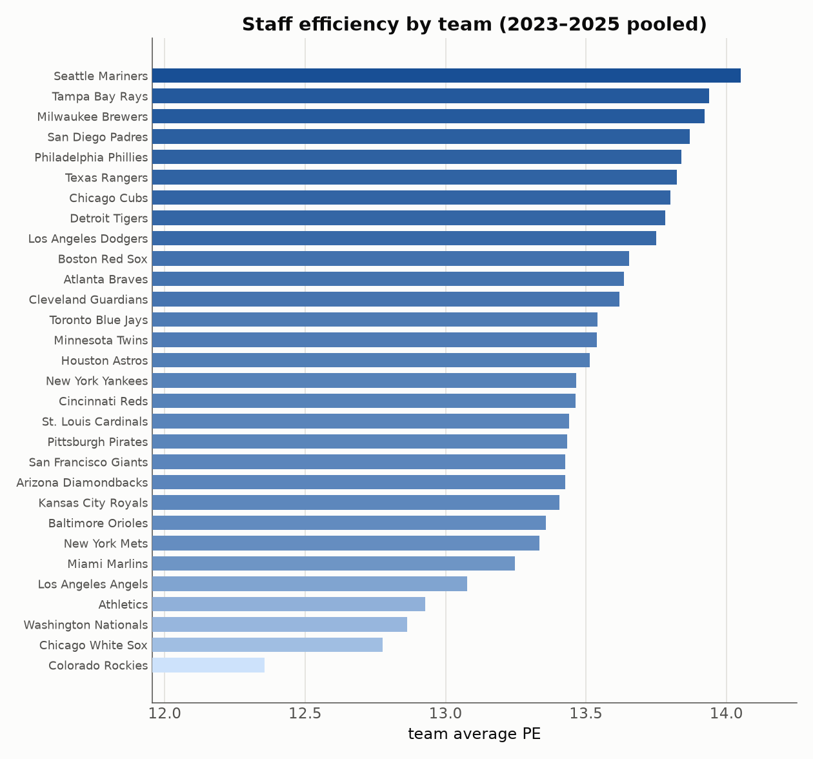

# Pitching Efficiency (PE)：一個好懂、好算，又貼近實力的投手指標

*作者：Chung-Hao Lee ｜ 資料：MLB 官方 Stats API，2023–2025 三個球季，投球局數（IP）≥ 50，約 1,000 個投手球季*

---

## 一個老問題：我們一直在「好懂」和「準確」之間二選一

評價一位投手，棒球迷手上大致有兩種工具。

一種是 **ERA（防禦率）**：人人都懂，算法簡單。但它有個致命盲點——**它只在乎「跑者有沒有回來得分」，不在乎「你被打得多慘」。** 一支被打穿全場、最後靠雙殺化解的局，和一支三上三下的局，在 ERA 眼裡可以完全一樣；被打一支一壘安打和被打一支全壘打，只要沒失分，帳面上也沒差別。ERA 看得到結果，看不到過程。

另一種是像 **wRC+、xFIP、SIERA** 這類進階指標：它們很準，但**計算繁瑣、入門門檻高**，多數球迷根本不知道它從哪來、怎麼算，只能把它當成一個「別人算好的黑盒子數字」照單全收。

**能不能有一個指標，既像 ERA 一樣一句話就能講清楚、一行就能算，又能真正貼近投手的實力？**

這篇文章介紹 **Pitching Efficiency（PE，投球效率）**，一個為了同時滿足這三件事而設計的指標：**好懂、好算、貼近實力。**

---

## 從《魔球》開始：出局，才是投手真正的稀缺資源

這個指標的靈感來自電影《魔球》。片中，數據分析師 Paul DePodesta 提醒總管 Billy Beane：棒球場上最重要的東西是**出局數**——一場比賽，每支球隊只有 **27 個出局**，在第 27 個出局到來之前得分多的一方獲勝。這正是奧克蘭運動家當年最看重上壘率（OBP）的原因：OBP 衡量的是打者「在出局之前上壘」的能力。

有趣的是，這股「以出局為核心」的思維，多半用在**打者**身上；輪到評價**投手**時，主流指標（ERA、FIP）卻幾乎都圍繞著「失分」打轉。

那麼，如果我們回到第一性原理，把投手的工作想成一筆交易——

> **他想買的東西，是出局（outs）。**
> **他付出的代價，是什麼？**

答案是**兩種成本**：

1. **球數（pitches）——力氣成本。** 每位投手每場大約只有 100 球的體力預算。用越少的球解決打者，就能投得越深、越省牛棚。這是「經濟性」。
2. **壘打數（TB, Total Bases）——損害成本。** 每讓出一個壘包，就離失分更近一步；而且一支全壘打（4 個壘打）的損害，是一支一壘安打（1 個壘打）的四倍。這正是 ERA 分不出、我們卻最想抓住的「損害品質」。

於是，投手效率的定義可以用一句話講完：

> ### 投球效率 ＝ 買到的出局數 ÷ 為此付出的總代價

---

## 公式：把「力氣」和「損害」加成同一張帳單

球數和壘打，本質上是**同一種東西**——都是投手為了拿下那 27 個出局所「消耗」的資源。既然是同一本帳，就該把它們**加起來**，變成一張總帳單：

$$\Large PE = \frac{100 \times \text{outs}}{\text{pitches} + 4 \times \text{TB}}$$

其中 `outs` 是製造的出局數、`pitches` 是投球數、`TB` 是被打的總壘打數。這三個數字都是公開資料，**一行就能算完**。

而那個 `4`，可以用一句話教會任何球迷：

> ### 「每被取得一個壘包，就像白投了 4 顆球。」

所以一支一壘安打 ≈ 浪費 4 球；一支全壘打（4 壘打）≈ 浪費 16 球，差不多是整整一位打者的用球量。**全壘打自動被懲罰得比一壘安打重四倍——這正是 ERA 做不到的事。**

**一個 30 秒的例子。** 兩位後援投手，各投 1 局、各用 15 球、各拿 3 個出局，唯一差別是被打的那一支：

| | 出局 | 球數 | 被打 | PE 計算 | **PE** |
|---|:--:|:--:|:--:|---|:--:|
| 投手 A：被打一壘安打 | 3 | 15 | 1 壘打 | 300 ÷ (15 + 4×1) | **15.8** |
| 投手 B：被打全壘打 | 3 | 15 | 4 壘打 | 300 ÷ (15 + 4×4) | **9.7** |

同樣的出局、同樣的球數，只因為 B 被打的是全壘打，PE 就從「優秀」掉到「掙扎」。這種區分，是 ERA（只要沒失分就一視同仁）永遠給不了的。

### 為什麼權重是「4」？兩條路都指向同一個答案

`4` 這個數字不是隨手挑的。它同時通過了兩道關卡：

- **棒球直覺**：用聯盟平均定錨，一局大約丟 15–16 球、讓出約 1.4 個壘打。要讓「損害」這條腿在總帳單裡有足夠份量（而不是被龐大的球數淹沒），一個壘包大約要換算成 4 顆球。
- **數學驗證**：下圖左側顯示，隨著權重改變，PE 與「投球局數」的相關性會跟著變。**這條線剛好在權重 ≈ 4 的地方穿過零**——也就是說，「一個壘包 ≈ 4 顆球」這個棒球直覺，同時正好是讓 PE **完全不受工作量影響**的那個值（下一節會詳談為什麼這很重要）。

而且右側顯示，權重在 **2 到 6 之間，排行榜幾乎不動**（Spearman 排名相關 ≥ 0.97）。換句話說，結論不是靠精挑權重湊出來的——PE 很穩健。

---

## 驗證一：PE 對先發和後援一視同仁

一個好的效率指標，不該因為你「投得多」或「投得少」就給你系統性的優待或懲罰。一位投 200 局的先發和一位投 60 局的後援，應該站在同一條起跑線上被比較。

因為 PE 的分子（出局）和分母（球數＋壘打）都會隨著局數等比例放大，**局數在分數中自動約分掉**。結果就是——

**PE 與投球局數的相關性只有 −0.02，形同零。** 那條趨勢線平得像一條水平線。橘點（後援）和藍點（先發）交織在一起，平均 PE 幾乎相同（後援 13.8、先發 13.2）。PE 衡量的是「效率」本身，而不是偷偷在衡量「你上場多久」。

---

## 驗證二：PE 真的抓到了投手的實力

指標公平還不夠，關鍵是它得**準**。如果 PE 真的反映投手好壞，那麼 PE 高的投手，就該有更低的 ERA、更低的被打擊率、更少的長打。

關係非常清楚：**PE 越高，ERA 越低（r = −0.82）、被打 OPS 越低（r = −0.89）。** 把 PE 和各種公認的實力指標放在一起看，全面呈現強烈的負相關：

被打 OPS、WHIP、ERA、FIP、被全壘打率，PE 全都抓得又緊又準。

**但請注意最下面那條——PE 和三振率（K/9）只有微弱的 +0.18。** 這不是缺點，反而是 PE 最有意思的地方：

> **PE 不只是三振的代名詞。**

它同時獎勵「用球省」和「不讓壘包」，所以那些**不靠狂飆三振、而是靠誘導軟弱擊球、快速解決打者**的投手，在 PE 眼中一樣是頂級——例如潛水艇球路的 Tyler Rogers、滾地球機器 Framber Valdez、精準壓制的 Cristopher Sánchez。這些人常被「三振至上」的視角低估，卻是 PE 榜上的常客。

---

## PE 的刻度：這個數字要多高才算好？

任何指標都需要一把可對照的尺。根據 2023–2025 全體投手的分佈：

| 分級 | PE | 說明 |
|---|:--:|---|
| 🟦 **頂尖 Elite** | ≥ 15.0 | 前 10%，賽揚等級 |
| 🔵 **優秀 Good** | 14.2 – 15.0 | 前 25%，可靠的先發／高信任後援 |
| ⚪ **平均 Average** | ≈ 13.4 | 聯盟中位數 |
| 🔸 **中下** | 12.7 – 13.4 | 後段輪值／一般後援 |
| 🔻 **掙扎** | < 12.2 | 後 10% |

記住三個錨點就夠用了：**15 是頂尖、13.4 是平均、12 以下要當心。**

---

## 排行榜：PE 選出來的都是誰？

**2023–2025 單季 PE 前 15 名（IP ≥ 50）**

| # | 投手 | 球季 | 隊 | 角色 | IP | ERA | **PE** |
|:--:|---|:--:|---|:--:|:--:|:--:|:--:|
| 1 | Emmanuel Clase | 2024 | CLE | 後援 | 74.1 | 0.61 | **18.8** |
| 2 | Raisel Iglesias | 2024 | ATL | 後援 | 69.1 | 1.95 | **17.9** |
| 3 | Adrian Morejón | 2025 | SD | 後援 | 73.2 | 2.08 | **17.7** |
| 4 | Tyler Rogers | 2025 | NYM | 後援 | 77.1 | 1.98 | **17.5** |
| 5 | Aroldis Chapman | 2025 | BOS | 後援 | 61.1 | 1.17 | **17.0** |
| 6 | Ryan Helsley | 2024 | STL | 後援 | 66.1 | 2.04 | **16.7** |
| 7 | Brusdar Graterol | 2023 | LAD | 後援 | 67.1 | 1.20 | **16.7** |
| 8 | Tyler Holton | 2024 | DET | 後援 | 94.1 | 2.19 | **16.6** |
| … | | | | | | | |
| 13 | **Trevor Rogers** | 2025 | BAL | **先發** | 109.2 | 1.81 | **16.2** |

榜首清一色是各隊的王牌後援與守護神——面孔完全符合直覺。而全體投手中排名最高的**先發**是 2025 年浴火重生的 Trevor Rogers。若只看先發：

**2023–2025 先發投手 PE 前 6 名**

| # | 投手 | 球季 | 隊 | IP | ERA | **PE** |
|:--:|---|:--:|---|:--:|:--:|:--:|
| 1 | Trevor Rogers | 2025 | BAL | 109.2 | 1.81 | **16.2** |
| 2 | Cristopher Sánchez | 2025 | PHI | 202.0 | 2.50 | **15.7** |
| 3 | Nathan Eovaldi | 2025 | TEX | 130.0 | 1.73 | **15.7** |
| 4 | Bryan Woo | 2024 | SEA | 121.1 | 2.89 | **15.6** |
| 5 | **Tarik Skubal** | 2025 | DET | 195.1 | 2.21 | **15.6** |
| 6 | Framber Valdez | 2024 | HOU | 176.1 | 2.91 | **15.5** |

**Tarik Skubal**——2024、2025 連兩年賽揚獎得主——在三個球季裡三度擠進先發前段，是 PE 眼中最穩定的頂級先發，這也再次印證了指標的說服力。

### PE 看得到、ERA 看不到的東西

看看這兩位先發：

| 投手 | 球季 | ERA | **PE** | 分級 |
|---|:--:|:--:|:--:|---|
| Tyler Glasnow | 2024 | 3.49 | **15.0** | 頂尖 |
| Charlie Morton | 2023 | 3.64 | **13.1** | 中下 |

**在 ERA 眼裡，他們幾乎是雙胞胎**（3.49 對 3.64）。但 PE 在兩人之間拉開了整整一個級距。原因藏在過程裡：Glasnow 用壓倒性的球威快速解決打者、極少讓出壘包；Morton 則投得更辛苦、被取得的壘包更多。**ERA 只看到最後的失分結果相近；PE 卻讀出了兩人「賺取出局」的效率天差地別。** 這，就是 PE 補上的那個維度。

---

## 球隊視角：哪些球團最會「有效率地」解決打者？

水手、光芒、釀酒人、教士、費城人領先群雄——這些正是近年以投手調度與培養聞名的球隊。而墊底的洛磯（主場 Coors Field 的高海拔惡夢）、白襪、國民，同樣毫不意外。PE 在球隊層級一樣通過了「符合常識」的檢驗。

---

## 誠實的限制：PE 是什麼、不是什麼

一個負責任的指標，要講清楚自己的邊界：

- **PE 是「描述」，不是「預測」。** 它精準描述一位投手**這個球季有多有效率**，但年度之間的穩定度大約和 ERA 相當（相關係數都在 0.2 上下）——所以它適合用來**回顧與評價**，不適合單獨拿來預測明年。想預測未來表現，仍該搭配 FIP、xFIP 這類指標。
- **權重 4 是一個「選擇」。** 它有紮實的棒球與數學依據，但終究是一個建模決定。好消息是，前面證明了在合理範圍（2–6）內排名幾乎不變。
- **PE 不做場地與對手校正。** 它是「原始效率」，不像 ERA-、FIP- 那樣針對球場、聯盟做過調整。Coors Field 的投手在 PE 上會吃虧，這是需要放在心裡的背景。
- **樣本仍需門檻。** 本文採 IP ≥ 50。局數太少的投手，任何比率型指標（包括 PE）都會劇烈震盪。

---

## 結論

Pitching Efficiency 用一道最樸素的除法，回答了一個最根本的問題：**這位投手，用多少代價，換到了多少出局？**

- **好懂**：出局 ÷（球數 ＋ 每個壘包算 4 球），一句話講完。
- **好算**：三個公開數字，一行公式，不需要黑盒子。
- **貼近實力**：與 ERA、OPS、WHIP 高度吻合，全壘打自動比一壘安打重四倍，對先發後援一視同仁，還抓得到那些被「三振至上」低估的效率型投手。

它不會、也不打算取代 wRC+ 或 FIP 那樣的精密工具。但如果你想要一個**能在腦中口算、又真的說得出投手好壞**的數字——PE 或許就是那個「兩全其美」的答案。

---

*資料來源：MLB Stats API（`statsapi.mlb.com`），2023–2025 三個例行賽季，篩選投球局數 ≥ 50，共約 1,000 個投手球季。FIP 以各季聯盟常數校正，使聯盟 FIP 等於聯盟 ERA。分析與圖表以 Python（pandas / matplotlib）產生。*
