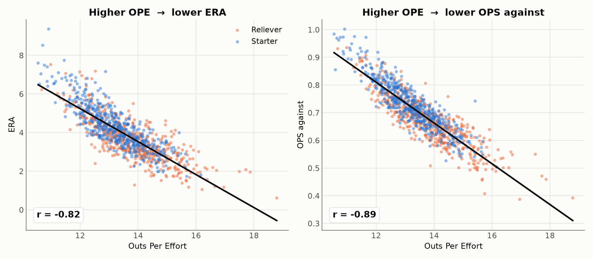

# Outs Per Effort (OPE): a simple pitching stat that sees what ERA misses

*By Chung-Hao Lee · A baseball analytics side-project*
*Data: MLB Stats API, 2023–2025 (≈1,000 pitcher-seasons, IP ≥ 50) · [中文版 →](README.cn.md)*

---

In 2023, Blake Snell won the National League Cy Young Award with a glittering 2.25 ERA. He also walked more batters than anyone else in the league and needed 17.6 pitches to get through a typical inning. Three hundred miles up the coast, Logan Webb quietly threw 216 innings of strike-pounding, ground-ball baseball and finished with a 3.25 ERA — a full run higher.

By the number everyone knows, Snell was the best pitcher in the league. But was he the most *efficient*? Your gut says no. **The problem is that our simplest stat can't tell you why.**

This is the gap I wanted to close — with a number you can compute in your head.

## The trade-off we keep making

Evaluating a pitcher usually means choosing between two kinds of stats.

**ERA** is universal and simple, but it has one blind spot: it only cares whether runners *scored*, not how hard you were hit. An inning where you're barreled all over the yard but escape on a double play looks identical to a 1-2-3 frame. A single and a home run are the same to ERA, as long as no one comes around. ERA sees the result, never the process.

The **advanced stats** — wRC+, SIERA, xFIP — fix the accuracy problem, but they're black boxes to most fans. You can't derive them on a napkin, so you take them on faith.

I wanted something that is **simple enough to compute by hand, yet honest enough to reflect how a pitcher actually pitched.**

## A first principle, borrowed from *Moneyball*

The idea starts with the insight that anchored *Moneyball*: the scarcest resource in baseball is the **out**. Each team gets exactly 27 of them, and whoever scores more before the 27th wins. It's why the A's prized on-base percentage — a measure of reaching base *before* making an out.

Curiously, that out-first lens is aimed almost entirely at hitters. When we grade pitchers, our marquee stats (ERA, FIP) all orbit around **runs**. So let's flip it. Think of a pitcher's job as a transaction:

> **What he's buying: outs.**
> **What he pays: two kinds of cost.**

1. **Pitches — the cost of effort.** A pitcher has a budget of roughly 100 pitches a night. The fewer he spends per out, the deeper he goes and the more bullpen he saves.
2. **Total bases — the cost of damage.** Every base he surrenders moves the opponent closer to scoring, and a home run (four bases) does four times the damage of a single (one base). This is exactly the distinction ERA throws away.

Two costs, one goal. Put them on the same bill, and you get the metric.

## The formula

$$\Large OPE = \frac{100 \times \text{outs}}{\text{pitches} + 4 \times \text{TB}}$$

Outs, pitches thrown, total bases allowed — three numbers off any box score, one line of arithmetic. And the `4` has a one-sentence translation any fan can hold onto:

> ### Every base you give up costs you like four wasted pitches.

So a single is worth about four squandered pitches; a home run, sixteen — roughly a full batter's worth of work. **Home runs are punished four times as hard as singles, automatically — the thing ERA can't do.**

**A 30-second example.** Two relievers each throw a clean-looking inning: 3 outs, 15 pitches. The only difference is the one ball that got hit.

| | outs | pitches | damage | OPE |
|---|:--:|:--:|:--:|:--:|
| Pitcher A — gives up a single | 3 | 15 | 1 base | 300 / (15 + 4×1) = **15.8** |
| Pitcher B — gives up a home run | 3 | 15 | 4 bases | 300 / (15 + 4×4) = **9.7** |

Identical outs, identical pitch count — but B's home run drops him from "good" to "struggling." ERA, which shrugs at both as long as no run scores, would never see the difference.

### A note on prior art

To be clear about what's new here: the term *pitching efficiency* already exists in baseball, but it has always meant **pitch economy alone** — pitches per out, pitches per inning ([The Hardball Times has written on it](https://tht.fangraphs.com/ruminations-on-pitching-efficiency/)). Set the base-weight to zero and OPE collapses back to exactly that classic idea, outs per pitch. **The `4 × TB` term — charging a pitcher for the damage he allows — is the new part.** OPE is pitch economy *and* damage control, fused on one scale. (I've named it **Outs Per Effort** to keep it distinct from the older, economy-only sense.)

### Why four?

The weight isn't arbitrary — it clears two independent bars.

- **The baseball argument.** A league-average inning runs about 15–16 pitches and surrenders roughly 1.4 bases. For the damage term to carry real weight in the bill (instead of drowning under the pitch count), a base has to be worth about four pitches.
- **The math argument.** The chart below (left) tracks how OPE correlates with innings pitched as the weight changes. **That line crosses zero right around 4** — meaning "a base ≈ four pitches" is also precisely the value that makes OPE *independent of workload* (more on why that matters next).

And it's robust: for any weight from 2 to 6, the leaderboard barely moves (Spearman rank agreement ≥ 0.97). The result isn't an artifact of a hand-tuned constant.

## Test 1 — OPE is fair to starters and relievers alike

A good efficiency stat shouldn't quietly reward you for pitching *more* or *less*. A 200-inning starter and a 60-inning reliever should stand on the same line.

Because OPE's numerator (outs) and denominator (pitches + bases) both scale with innings, workload cancels out of the ratio:

The correlation between OPE and innings pitched is **−0.02 — effectively zero.** Relievers (orange) and starters (blue) intermingle, and the trend line is flat. OPE measures efficiency itself, not how long you were on the mound.

## Test 2 — OPE tracks how good a pitcher actually is

Fairness is nice; accuracy is the point. If OPE means anything, high-OPE pitchers should post lower ERAs, weaker opponent hitting lines, and fewer extra-base hits.

They do — clearly. Higher OPE goes with lower ERA (r = −0.82) and lower opponent OPS (r = −0.89). Line OPE up against every standard measure of run prevention and the relationship is strong across the board:

Opponent OPS, WHIP, ERA, FIP, home-run rate — OPE tracks all of them tightly. But look at the bottom bar: **OPE's tie to strikeout rate (K/9) is a weak +0.18.** That's not a bug — it's the most interesting thing about the stat:

> **OPE is not just strikeouts in disguise.**

Because it rewards *economy* and *contact management*, not just swing-and-miss, it credits the pitchers who work fast and induce weak contact — submariner Tyler Rogers, ground-ball artist Framber Valdez, pinpoint Cristopher Sánchez. The strikeout-first lens tends to underrate these arms. OPE doesn't.

## The scale: how high is good?

Every stat needs a ruler. From the full 2023–2025 distribution:

| Tier | OPE | Meaning |
|---|:--:|---|
| 🟦 **Elite** | ≥ 15.0 | top 10% — Cy Young class |
| 🔵 **Good** | 14.2 – 15.0 | top 25% — a dependable starter or high-leverage reliever |
| ⚪ **Average** | ≈ 13.4 | the league median |
| 🔸 **Below average** | 12.7 – 13.4 | back-of-rotation / middle relief |
| 🔻 **Struggling** | < 12.2 | bottom 10% |

Three anchors are enough to carry in your head: **15 is elite, 13.4 is average, below 12 is trouble.**

## The leaderboard: who does OPE love?

**Top 15 pitcher-seasons, 2023–2025 (IP ≥ 50)**

| # | Pitcher | Year | Team | Role | IP | ERA | OPE |
|:--:|---|:--:|:--:|:--:|:--:|:--:|:--:|
| 1 | Emmanuel Clase | 2024 | CLE | RP | 74.1 | 0.61 | **18.8** |
| 2 | Raisel Iglesias | 2024 | ATL | RP | 69.1 | 1.95 | **17.9** |
| 3 | Adrian Morejón | 2025 | SD | RP | 73.2 | 2.08 | **17.7** |
| 4 | Tyler Rogers | 2025 | NYM | RP | 77.1 | 1.98 | **17.5** |
| 5 | Aroldis Chapman | 2025 | BOS | RP | 61.1 | 1.17 | **17.0** |
| 6 | Ryan Helsley | 2024 | STL | RP | 66.1 | 2.04 | **16.7** |
| 7 | Brusdar Graterol | 2023 | LAD | RP | 67.1 | 1.20 | **16.7** |
| 8 | Tyler Holton | 2024 | DET | RP | 94.1 | 2.19 | **16.6** |
| … | | | | | | | |
| 13 | **Trevor Rogers** | 2025 | BAL | **SP** | 109.2 | 1.81 | **16.2** |

The top of the board is elite relievers and closers — exactly the faces you'd expect. The highest-ranked **starter** is 2025's breakout Trevor Rogers. Among starters only:

**Top starters by OPE, 2023–2025**

| # | Pitcher | Year | Team | IP | ERA | OPE |
|:--:|---|:--:|:--:|:--:|:--:|:--:|
| 1 | Trevor Rogers | 2025 | BAL | 109.2 | 1.81 | **16.2** |
| 2 | Cristopher Sánchez | 2025 | PHI | 202.0 | 2.50 | **15.7** |
| 3 | Nathan Eovaldi | 2025 | TEX | 130.0 | 1.73 | **15.7** |
| 4 | Bryan Woo | 2024 | SEA | 121.1 | 2.89 | **15.6** |
| 5 | **Tarik Skubal** | 2025 | DET | 195.1 | 2.21 | **15.6** |
| 6 | Framber Valdez | 2024 | HOU | 176.1 | 2.91 | **15.5** |

Back-to-back Cy Young winner **Tarik Skubal** lands in the top of the starter board in all three seasons — a reassuring sign the stat is pointing at the right people.

### What OPE sees that ERA doesn't

Consider two starters:

| Pitcher | Year | ERA | OPE | Tier |
|---|:--:|:--:|:--:|---|
| Tyler Glasnow | 2024 | 3.49 | **15.0** | Elite |
| Charlie Morton | 2023 | 3.64 | **13.1** | Below average |

**To ERA, they're near-twins.** OPE puts a full tier between them. The difference is in the process: Glasnow overpowered hitters and gave up almost nothing; Morton grinded, allowing far more baserunners for the same bottom-line ERA. ERA saw two similar results. OPE saw two very different pitchers — which is the whole point.

## Which staffs are the most efficient?

Zoom out from individuals to whole pitching staffs and OPE passes the smell test again:

The Mariners, Rays, Brewers, Padres and Phillies sit on top — the very organizations known for developing and deploying pitching. At the bottom: the Rockies (hello, Coors Field), White Sox and Nationals. Nothing here will surprise you, which is exactly the point — a new stat should agree with what we already know before it tells us something we don't.

## OPE vs the voters: the Cy Young test

So how does OPE line up with the sport's official verdict on its best pitchers? I pulled every Cy Young winner from 2023–2025 and found where they ranked in their own league's OPE.

For the **efficiency-driven** winners, OPE and the writers are in lockstep: Skubal ranks near the top of the AL starter board both years; Gerrit Cole was right there in 2023. These were dominant, economical seasons, and OPE says so.

Then there's **Blake Snell, 2023** — the pitcher we opened with, and the biggest split on the board. OPE ranked him just 14th among NL starters. Here's why, side by side with the man OPE crowned instead:

| 2023 NL | IP | ERA | FIP | Walks | Pitches/inning | OPE |
|---|:--:|:--:|:--:|:--:|:--:|:--:|
| Blake Snell (Cy Young) | 180.0 | 2.25 | 3.38 | **99** | **17.6** | 13.86 |
| Logan Webb (OPE's pick) | 216.0 | 3.25 | 3.10 | **31** | **14.7** | 14.75 |

They threw almost the same number of pitches. Webb turned his into 36 more innings, with a third the walks and a better FIP. Snell's ERA was lower — he was brilliant at stranding the traffic he created — but by every measure of *process*, Webb was the more efficient pitcher, and even FIP agrees with OPE over ERA here. **This is the single clearest illustration of what OPE adds: it grades the pitching, not just the scoreboard.**

## Greatness is consistency: the legends

A one-season snapshot is one thing. What separates the inner circle is doing it *every year*. So I traced OPE across five Hall-of-Fame careers.

| Pitcher | Career OPE | Span |
|---|:--:|:--:|
| Greg Maddux | **15.5 ± 0.7** | 1988–2008 |
| Mariano Rivera | 15.5 ± 1.4 | 1995–2013 |
| Clayton Kershaw | 15.1 ± 1.1 | 2008–2025 |
| Pedro Martínez | 14.8 ± 1.2 | 1993–2009 |
| Justin Verlander | 13.8 ± 0.9 | 2006–2025 |

Recall that the league average is 13.4 and that OPE, like most rate stats, is only modestly self-correlated year to year for the general population. Yet these arms parked in the "Good-to-Elite" band for **fifteen to twenty seasons straight.** Greg Maddux — fittingly, the patron saint of pitch efficiency — averaged 15.5 across *21 years* with a standard deviation of just 0.7. Sustained, high OPE turns out to be a fingerprint of greatness.

## The 2026 watch

With the 2026 season about 55% complete, here's the starter leaderboard so far:

OPE's most efficient starter to date is Brewers rookie phenom **Jacob Misiorowski** (16.5, 1.62 ERA). Notably, the two-time defending Cy Young winner Skubal has slipped to 25th in OPE this year (3.06 ERA) — a real, measurable step back from his back-to-back peak.

**One honest caveat:** OPE is a *descriptive* stat, not a crystal ball. Year-to-year it's about as stable as ERA (both hover near 0.2), so read this board as "who has pitched most efficiently so far," not a locked-in prediction. If you want to forecast, pair OPE with FIP and xFIP.

## What OPE is — and isn't

- **It describes; it doesn't predict.** OPE captures how efficient a pitcher *was* this season. Use it to evaluate, not to project next year on its own.
- **The weight of 4 is a modeling choice** — well-grounded, and robust across a wide range, but a choice.
- **No park or opponent adjustment.** OPE is raw efficiency; it isn't scaled for Coors Field or league run environment the way ERA- and FIP- are.
- **Small samples stay noisy.** Everything here uses IP ≥ 50; below that, OPE (like any rate stat) swings wildly.

## The bottom line

Outs Per Effort answers the most basic question in pitching with one plain division: **how many outs did this pitcher buy, and how much did he pay?**

- **Simple** — outs ÷ (pitches + four per base), computable in your head.
- **Transparent** — three box-score numbers, no black box.
- **Descriptive** — it moves with ERA, OPS, and WHIP; it charges four times as much for a homer as a single; it judges starters and relievers alike; and it catches the efficient arms a strikeout-first view walks right past.

It won't replace wRC+ or SIERA, and it isn't trying to. But if you want a number you can work out on a napkin that still tells you something true about how a pitcher pitched — OPE is that number.

---

### Methodology & reproducibility

Everything here is reproducible from this repo:

- **Data** — [`data/`](data/): raw pitching lines pulled from the public MLB Stats API (`statsapi.mlb.com`), regular season, 2023–2025 plus 2026-to-date, and career lines for the legends.
- **Fetch it yourself** — [`scripts/fetch_pe_data.py`](scripts/fetch_pe_data.py) (`python3 fetch_pe_data.py 2026`) and [`scripts/fetch_legends.py`](scripts/fetch_legends.py). Standard library only, no dependencies.
- **Recompute & re-plot** — [`scripts/analyze_pe.py`](scripts/analyze_pe.py) and [`scripts/make_charts.py`](scripts/make_charts.py) (pandas + matplotlib).

Sample: pitcher-seasons with IP ≥ 50 (≈1,000 across 2023–2025). `outs` and `TB` are taken directly from the API; FIP uses a per-season constant so that league FIP equals league ERA. The original 2022 prototype of this idea is preserved in [`archive/`](archive/).
